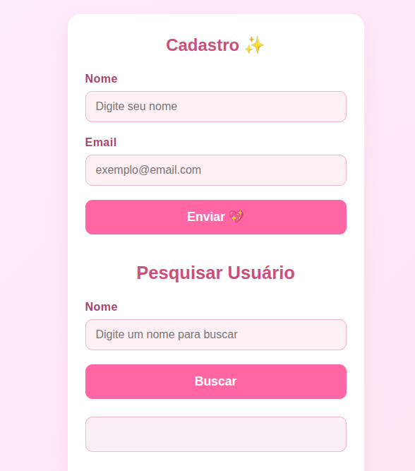

# Projeto ORM com Knex.js

Este é um projeto de exemplo que demonstra o uso do Knex.js como um construtor de consultas SQL em um ambiente Node.js com TypeScript.

## Descrição

O projeto consiste em uma API simples para gerenciamento de usuários, utilizando Express.js para o servidor, Knex.js para a comunicação com o banco de dados SQLite e Zod para validação de dados.
## Preview 



## Tecnologias Utilizadas

- **Node.js**: Ambiente de execução do JavaScript no servidor.
- **TypeScript**: Superset do JavaScript que adiciona tipagem estática.
- **Express.js**: Framework para construção de APIs web.
- **Knex.js**: Construtor de consultas SQL para Node.js.
- **SQLite3**: Banco de dados relacional embarcado.
- **tsx**: Executa arquivos TypeScript diretamente sem a necessidade de compilação prévia.
- **Zod**: Biblioteca para validação de esquemas de dados.

## Instalação

1.  Clone o repositório:
    ```bash
    git clone <url-do-repositorio>
    ```
2.  Acesse o diretório do projeto:
    ```bash
    cd orm
    ```
3.  Instale as dependências:
    ```bash
    npm install
    ```

## Scripts Disponíveis

No arquivo `package.json`, os seguintes scripts estão disponíveis:

-   `npm run dev`: Inicia o servidor em modo de desenvolvimento com `watch mode`.
-   `npm run knex -- <comando>`: Executa comandos do Knex.js. Por exemplo, para criar uma nova migração: `npm run knex -- migrate:make nome_da_migracao`.
-   `npm run latest`: Executa as migrações pendentes para atualizar o banco de dados para a versão mais recente.
-   `npm run roolback`: Reverte a última migração executada.

## Estrutura do Projeto

```
/home/thomaz-alves/Charles/Tech/2Sem2025/orm/
├───knexfile.ts             # Arquivo de configuração do Knex
├───package.json
├───tsconfig.json
└───src/
    ├───server.ts           # Arquivo principal do servidor Express
    ├───controllers/        # Controladores (lógica de requisição/resposta)
    ├───errors/             # Classes de erro customizadas
    ├───models/
    │   ├───database/       # Configuração e instância do banco de dados
    │   ├───migrations/     # Arquivos de migração do banco de dados
    │   ├───seeds/          # Arquivos de seed para popular o banco
    │   └───types/          # Definições de tipos (interfaces)
    ├───public/             # Arquivos estáticos (HTML, CSS, JS)
    └───routes/             # Definição das rotas da API
```

## Rotas da API

A API possui as seguintes rotas:

-   `GET /`: Rota de boas-vindas.
-   `GET /user`: Retorna uma lista de todos os usuários.
-   `POST /user`: Cria um novo usuário.
-   `GET /user/pesquisar`: Pesquisa usuários por nome.

## Como Contribuir

1.  Faça um fork do projeto.
2.  Crie uma nova branch (`git checkout -b feature/nova-feature`).
3.  Faça commit das suas alterações (`git commit -m 'Adiciona nova feature'`).
4.  Faça push para a branch (`git push origin feature/nova-feature`).
5.  Abra um Pull Request.
